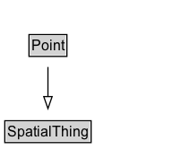

# Point

## Diagram

=== "SVG (interactive)"

    <!-- Generated by graphviz version 14.0.2 (20251019.1705)
     -->
    <!-- Pages: 1 -->
    <svg width="159pt" height="132pt"
     viewBox="0.00 0.00 159.00 132.00" xmlns="http://www.w3.org/2000/svg" xmlns:xlink="http://www.w3.org/1999/xlink">
    <g id="graph0" class="graph" transform="scale(1 1) rotate(0) translate(4 128)">
    <polygon fill="white" stroke="none" points="-4,4 -4,-128 155.12,-128 155.12,4 -4,4"/>
    <g id="clust2" class="cluster">
    <title>cluster_associated</title>
    </g>
    <!-- Point -->
    <g id="node1" class="node">
    <title>Point</title>
    <g id="a_node1"><a xlink:href="../Point" xlink:title="&lt;TABLE&gt;">
    <polygon fill="lightgray" stroke="none" points="21.25,-81.88 21.25,-98.12 51,-98.12 51,-81.88 21.25,-81.88"/>
    <text xml:space="preserve" text-anchor="start" x="22.25" y="-85.72" font-family="Arial" font-size="12.00">Point</text>
    <polygon fill="none" stroke="black" points="20.25,-80.88 20.25,-99.12 52,-99.12 52,-80.88 20.25,-80.88"/>
    </a>
    </g>
    </g>
    <!-- SpatialThing -->
    <g id="node3" class="node">
    <title>SpatialThing</title>
    <g id="a_node3"><a xlink:href="../SpatialThing" xlink:title="&lt;TABLE&gt;">
    <polygon fill="lightgray" stroke="none" points="1,-9.88 1,-26.12 71.25,-26.12 71.25,-9.88 1,-9.88"/>
    <text xml:space="preserve" text-anchor="start" x="2" y="-13.72" font-family="Arial" font-size="12.00">SpatialThing</text>
    <polygon fill="none" stroke="black" points="0,-8.88 0,-27.12 72.25,-27.12 72.25,-8.88 0,-8.88"/>
    </a>
    </g>
    </g>
    <!-- Point&#45;&gt;SpatialThing -->
    <g id="edge1" class="edge">
    <title>Point&#45;&gt;SpatialThing</title>
    <path fill="none" stroke="black" d="M36.12,-72.05C36.12,-64.57 36.12,-55.58 36.12,-47.14"/>
    <polygon fill="none" stroke="black" points="39.63,-47.3 36.13,-37.3 32.63,-47.3 39.63,-47.3"/>
    </g>
    <!-- Invis -->
    </g>
    </svg>

=== "PNG"

    

## Formalization for Point

| Property | Constraint |
|----------|------------|
| subClassOf | [SpatialThing](SpatialThing.md) |

