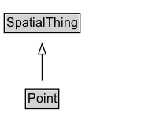

# Point

A point, typically described using a coordinate system relative to Earth, such as WGS84.

NOTE: 
Uniquely identified by lat/long/alt. i.e.

spaciallyIntersects(P1, P2) :- lat(P1, LAT), long(P1, LONG), alt(P1, ALT),
  lat(P2, LAT), long(P2, LONG), alt(P2, ALT).

sameThing(P1, P2) :- type(P1, Point), type(P2, Point), spaciallyIntersects(P1, P2).
  

## Diagram

=== "SVG (interactive)"

    <!-- Generated by graphviz version 14.1.3 (20260303.0454)
     -->
    <!-- Pages: 1 -->
    <svg width="159pt" height="132pt"
     viewBox="0.00 0.00 159.00 132.00" xmlns="http://www.w3.org/2000/svg" xmlns:xlink="http://www.w3.org/1999/xlink">
    <g id="graph0" class="graph" transform="scale(1 1) rotate(0) translate(4 128)">
    <polygon fill="white" stroke="none" points="-4,4 -4,-128 155.12,-128 155.12,4 -4,4"/>
    <g id="clust3" class="cluster">
    <title>cluster_associated</title>
    </g>
    <!-- SpatialThing -->
    <g id="node1" class="node">
    <title>SpatialThing</title>
    <g id="a_node1"><a xlink:href="../SpatialThing" xlink:title="&lt;TABLE&gt;">
    <polygon fill="lightgray" stroke="none" points="1,-97.88 1,-114.12 71.25,-114.12 71.25,-97.88 1,-97.88"/>
    <text xml:space="preserve" text-anchor="start" x="2" y="-101.88" font-family="Arial" font-size="12.00">SpatialThing</text>
    <polygon fill="none" stroke="black" points="0,-96.88 0,-115.12 72.25,-115.12 72.25,-96.88 0,-96.88"/>
    </a>
    </g>
    </g>
    <!-- Point -->
    <g id="node2" class="node">
    <title>Point</title>
    <g id="a_node2"><a xlink:href="../Point" xlink:title="&lt;TABLE&gt;">
    <polygon fill="lightgray" stroke="none" points="21.25,-25.88 21.25,-42.12 51,-42.12 51,-25.88 21.25,-25.88"/>
    <text xml:space="preserve" text-anchor="start" x="22.25" y="-29.88" font-family="Arial" font-size="12.00">Point</text>
    <polygon fill="none" stroke="black" points="20.25,-24.88 20.25,-43.12 52,-43.12 52,-24.88 20.25,-24.88"/>
    </a>
    </g>
    </g>
    <!-- Point&#45;&gt;SpatialThing -->
    <g id="edge1" class="edge">
    <title>Point&#45;&gt;SpatialThing</title>
    <path fill="none" stroke="black" d="M36.12,-51.79C36.12,-59.25 36.12,-68.24 36.12,-76.69"/>
    <polygon fill="none" stroke="black" points="32.63,-76.54 36.13,-86.54 39.63,-76.54 32.63,-76.54"/>
    </g>
    <!-- Invis -->
    </g>
    </svg>

=== "PNG"

    

## Formalization for Point

| Property | Constraint |
|----------|------------|
| subClassOf | [SpatialThing](SpatialThing.md) |

